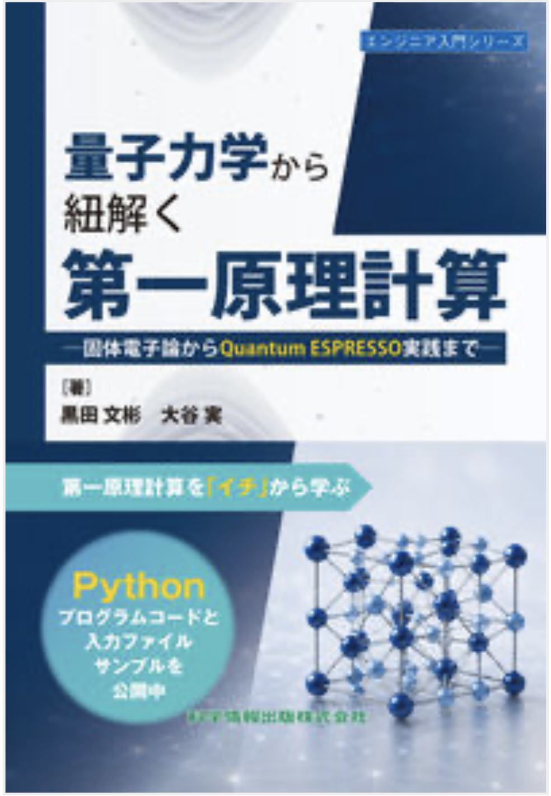

<p align="center">
  
</p>

<h1 align="center">
量子力学から紐解く第一原理計算<br>
―固体電子論からQuantum ESPRESSO実践まで―
</h1>

この GitHub organization は、以下の教科書を補足するためのサポートサイトです。

```text
量子力学から紐解く第一原理計算
―固体電子論からQuantum ESPRESSO実践まで―
```

本書の情報は、以下のページから確認できます。

- 科学情報出版 書籍ページ  
  https://www.it-book.co.jp/books/178.html
- Amazon  
  https://amzn.asia/d/06FoBECk

本サイトでは、誤植や修正が必要な箇所の確認と、第一原理計算を学ぶための hands-on プログラムや入力ファイルを公開、及び補足情報の提供を目的としています。
ただし、当サイトの内容を参考にして得られた計算結果に関するいかなるトラブルに対しても一切責任は負いかねますのでご了承下さい。
特に、ご自身が使用するパソコンや計算機の計算能力と本hands-onで使われている初期値が見合うものなのか十分に注意してご利用ください。

## Correction

https://github.com/FPTEXTBOOK-KurodaOtani/Correction

大変申し訳ございませんが、
本文中に誤植や修正が必要な箇所があります。教科書を読み始める前に、まず `Correction` をご確認ください。学習を進める前に `Correction` を確認していただくことで、より正確に内容を理解と存じます。
こちらに記載されていない誤植や不明点・質問などがございましたら、CorrectionのIssue( https://github.com/FPTEXTBOOK-KurodaOtani/Correction/issues )として、お教え願えましたら幸いです。

##  Hands_on Repository Overview

本サイトには、主に以下の hands-on 用リポジトリがあります。このRepository内のテキストファイルは、文字化けを避けるため英語で記述しています。

```text
Hands_on_sec31
Hands_on_sec32
Hands_on_sec33
```

それぞれの内容は以下の通りです。

## > Hands_on_sec31

https://github.com/FPTEXTBOOK-KurodaOtani/Hands_on_sec31

`Hands_on_sec31` には、教科書の基礎的な内容を理解するための Python プログラムが含まれています。

これらの基礎プログラムは Python で書かれています。読者の皆さまには、本書の該当箇所を参考にしながらプログラムを読み、計算の意味を理解していただくことを想定しています。

また、入力パラメータを変更することで、出力結果がどのように変化するかを確認し、その物理的な意味について考察していただければ幸いです。

## > Hands_on_sec32

https://github.com/FPTEXTBOOK-KurodaOtani/Hands_on_sec32

`Hands_on_sec32` には、Atomic Simulation Environment (ASE) や Python Materials Genomics (Pymatgen) を用いた簡単な hands-on を用意しています。

主に、Quantum ESPRESSO (QE) の入力ファイルを Python で作成する方法や、構造データを扱うための基本的な操作を確認する内容になっています。

ASE や Pymatgen を用いることで、結晶構造の作成、変換、入力ファイル生成などを効率的に行うことができます。

## > Hands_on_sec33

https://github.com/FPTEXTBOOK-KurodaOtani/Hands_on_sec33

`Hands_on_sec33` には、Quantum ESPRESSO (QE) を用いた DFT 計算の練習用入力ファイルを用意しています。

ここでは、QE を使った DFT 計算の練習と、本書で議論してきた内容の確認を目的として、いくつかの演習用入力ファイルをまとめています。

計算手順については、各ディレクトリ内の `README.md` ファイルを参照してください。

##  Supporting_infomation

本書の本文で、補足としていた部分を中心に、補足内容について説明しています。現在、作成中です。完成次第、随時更新しますので、申し訳ございませんがしばらくお待ちください。

